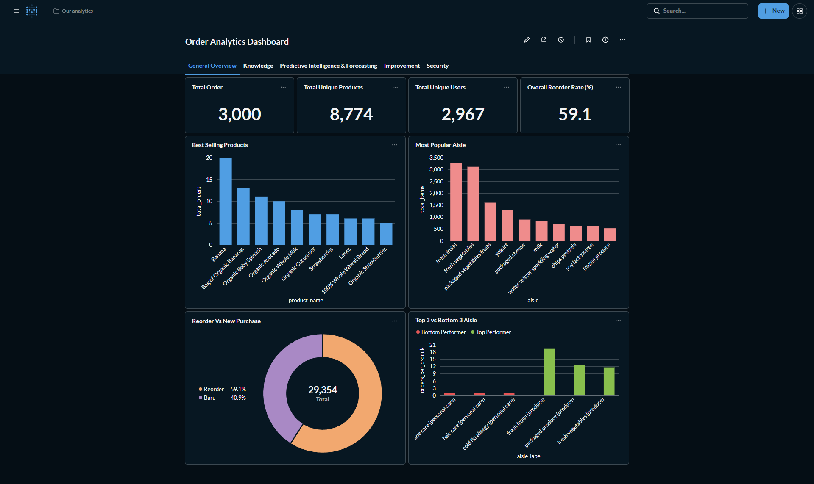
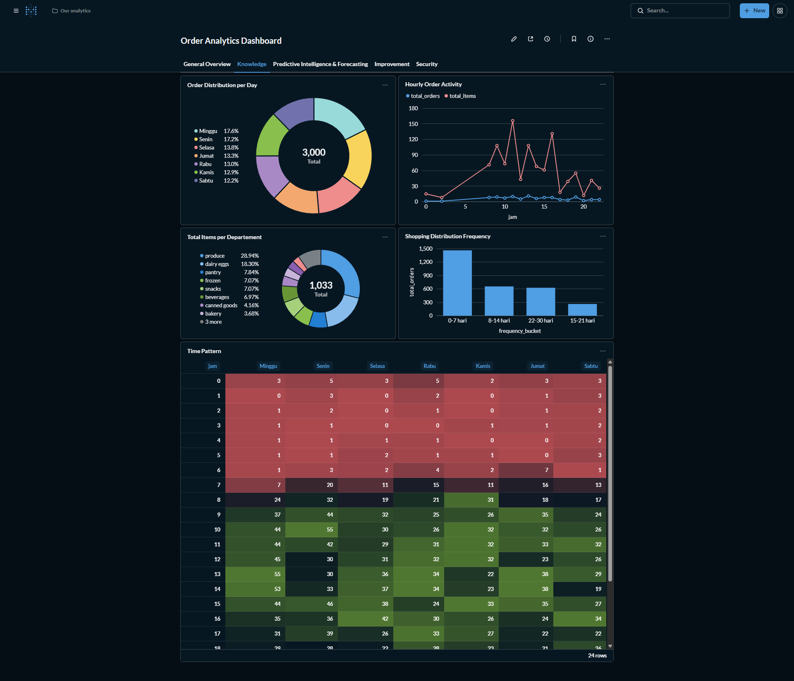
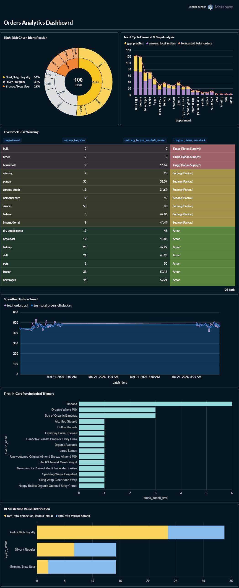
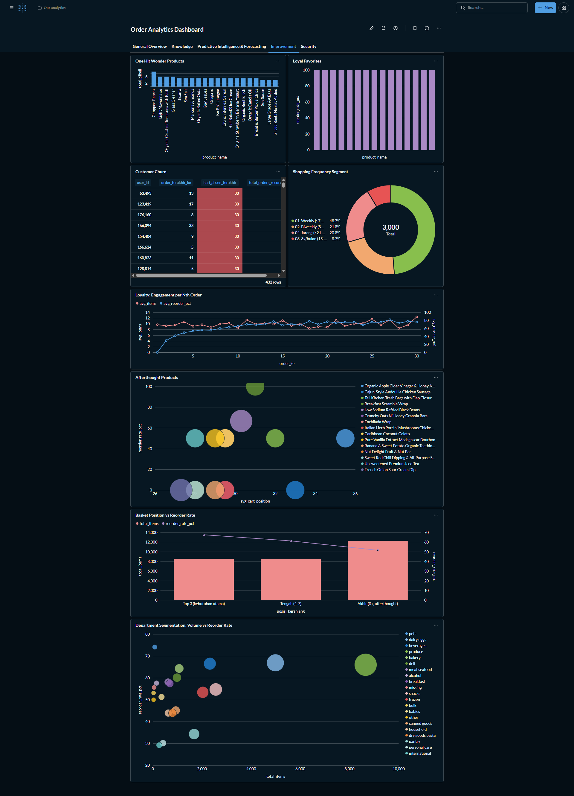
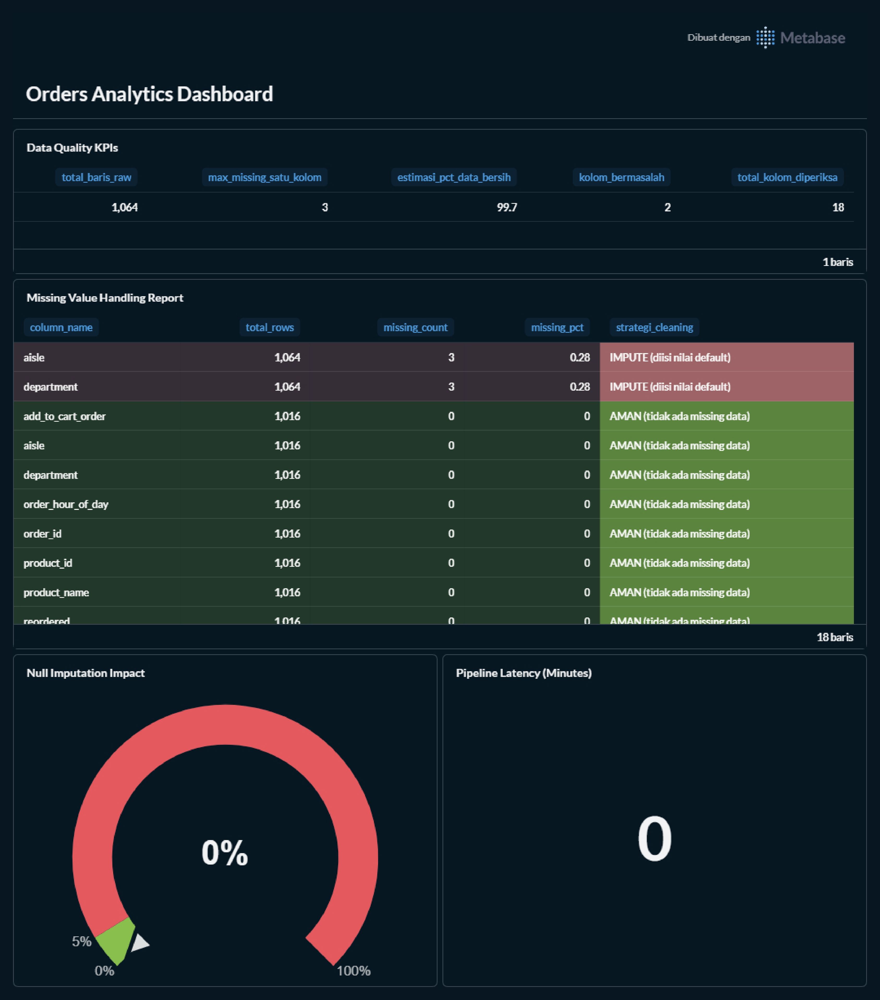
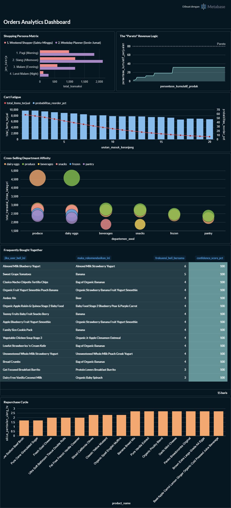

<div align="center">

# Orders Analytics Pipeline

### Pipeline Orchestration & Data Visualization — MCI Lab Oprec 2026


> **Architecture:** Hybrid Lambda Architecture — Batch Processing (PySpark) + Near Real-Time Speed Layer (5-minute Airflow) → Unified ClickHouse Serving Layer

</div>

---

## Table of Contents

1. [Team](#team)
2. [Hybrid Lambda Architecture](#hybrid-lambda-architecture)
3. [Fetch API & Data Ingestion](#fetch-api--data-ingestion)
4. [Dataset Schema & EDA](#dataset-schema--eda)
5. [Data Cleaning Pipeline](#data-cleaning-pipeline)
6. [Spark Processing & Aggregation](#spark-processing--aggregation)
7. [ClickHouse Data Warehouse](#clickhouse-data-warehouse)
8. [Docker Setup](#docker-setup)
9. [Running the Pipeline End-to-End](#running-the-pipeline-end-to-end)
10. [Proof: Airflow & ClickHouse Running](#proof-airflow--clickhouse-running)
11. [Metabase Dashboard — 6 Tabs, 39 Queries](#metabase-dashboard--6-tabs-39-queries)
12. [Insights](#insights)
13. [References](#references)

---

## Team

<table align="center">
  <tr>
    <td align="center" width="300">
      <b>Farikh Muhammad Fauzan</b><br>
      <code>5025241135</code>
    </td>
    <td align="center" width="300">
      <b>Raymond Julius Pardosi</b><br>
      <code>5025241268</code>
    </td>
  </tr>
</table>

**Kelompok 14 — Tugas 2 MCI Oprec 2026**

---

## Hybrid Lambda Architecture

This pipeline implements a **Hybrid Lambda Architecture** — a Big Data architectural pattern combining a *Batch Layer* and *Speed Layer* into a single unified *Serving Layer*.

### Why Hybrid Lambda?

| Layer | Our Implementation | Purpose |
|-------|-------------------|---------|
| **Batch Layer** | Apache Spark processes accumulated Parquet files from the Data Lake | High accuracy, complex transformations (RFM, forecasting, multi-level aggregation) |
| **Speed Layer** | Airflow schedule `*/5 * * * *` + APPEND to `history_department_trend` | Near real-time visibility (NRT) without waiting for daily batch |
| **Serving Layer** | ClickHouse with two patterns: APPEND (time-series) + TRUNCATE-INSERT (snapshot) | Single source of truth serving both analytic and monitoring queries |

This combination addresses the weaknesses of pure architectures:
- **Batch-only** → stale data, no intraday visibility
- **Streaming-only** → high complexity, difficult for heavy aggregations such as Sales Forecasting or RFM

### Data Flow Diagram

```
┌───────────────────────────────────────────────────────────────────┐
│                     HYBRID LAMBDA ARCHITECTURE                    │
└───────────────────────────────────────────────────────────────────┘

  Orders API (http://96.9.212.102:8000/orders)
           │
           ▼ HTTP GET, timeout 30s, ~100 orders per call
  ╔══════════════════════════════╗
  ║   SPEED LAYER (Ingest NRT)  ║   fetch_orders.py
  ║   Flatten nested JSON        ║   → every 5 minutes via Airflow
  ║   Save .parquet v1.0         ║
  ╚══════════╤═══════════════════╝
             │  /opt/airflow/data_lake/orders/*.parquet
             ▼
  ╔══════════════════════════════╗
  ║   BATCH LAYER (Transform)   ║   process_orders_spark.py
  ║   PySpark Data Cleaning      ║   → 9 OLAP Aggregations
  ║   9 Aggregations             ║   → Caching (MEMORY_AND_DISK)
  ║   RFM · Forecast · Heatmap   ║   → Auto-cleanup Parquet
  ╚══════════╤═══════════════════╝
             │
             ▼
  ╔══════════════════════════════════════════════════════════════╗
  ║                   SERVING LAYER — ClickHouse                ║
  ║                                                              ║
  ║  Database: orders_db             Database: analytics         ║
  ║  ┌─────────────────────────┐    ┌──────────────────────────┐║
  ║  │ order_items    [APPEND] │    │ sales_forecasting        │║
  ║  │ daily_summary  [APPEND] │    │ user_loyalty_segmentation│║
  ║  │ history_dept   [APPEND] │    │ product_cart_priority    │║
  ║  │ top_products   [TRUNC]  │    │ products_performance     │║
  ║  │ dept_summary   [TRUNC]  │    │ hourly_capacity          │║
  ║  │ hourly_activity[TRUNC]  │    │ history_dept   [APPEND]  │║
  ║  │ data_quality   [AUDIT]  │    └──────────────────────────┘║
  ║  └─────────────────────────┘                                ║
  ╚══════════╤═══════════════════════════════════════════════════╝
             │
             ▼
  ╔═══════════════════════════════════════════╗
  ║   Metabase Dashboard — 6 Tabs, 39 Queries ║
  ║   Overview · Knowledge · Predictive       ║
  ║   Improvements · Governance · AI Engine   ║
  ╚═══════════════════════════════════════════╝

  Full cycle repeats every 5 minutes — orchestrated by Apache Airflow
```

### Flow Summary

| Step | File | Output |
|------|------|--------|
| Ingest | `fetch_orders.py` | Timestamped `.parquet` files in the Data Lake |
| Transform | `process_orders_spark.py` | 13 tables in ClickHouse (2 databases) |
| Orchestrate | `orders_pipeline_dag.py` | Schedule `*/5 * * * *`, retry 3x, 5-minute delay |
| Visualize | Metabase | 6 tabs, 39 charts/queries |

---

## Fetch API & Data Ingestion

`fetch_orders.py` is the data entry point — it fetches from the REST API, flattens the nested structure, and writes to the Data Lake.

### Fetch Workflow

```
Orders API
    │
    ▼ HTTP GET · timeout 30s · raise_for_status()
JSON Response (Nested — 1 order : N products)
    │
    ▼ Iterate: for order → for product → append row
Flattened Python List of Dicts
    │
    ▼ pd.DataFrame()
Pandas DataFrame (1 row = 1 product in 1 order)
    │
    ▼ to_parquet(version='1.0', engine='pyarrow')
/opt/airflow/data_lake/orders/orders_YYYYMMDD_HHMMSS.parquet
```

### Why Flatten Here, Not in Spark?

The API returns **nested JSON** — one order contains an array of products:

```json
{
  "order_id": 7,
  "user_id": 42,
  "order_dow": 3,
  "products": [
    { "product_id": 196, "product_name": "Soda", "department": "beverages" },
    { "product_id": 10258, "product_name": "Organic String Cheese", "department": "dairy eggs" }
  ]
}
```

Spark can read nested JSON, but **exploding arrays in Spark is significantly heavier** than flattening in Python at ingest time. By flattening in Python, Spark receives tabular Parquet ready for direct processing.

| Before Flatten | After Flatten |
|----------------|---------------|
| 1 row = 1 order + N nested products | 1 row = 1 product within 1 order |
| Not directly queryable | Ready for SQL, JOIN, GROUP BY |

### Why Parquet Version 1.0?

```python
# CRITICAL FIX — without this, Spark JVM throws UnsupportedOperationException
df.to_parquet(output_path, index=False, engine='pyarrow', version='1.0')
```

Parquet v2.0+ uses *delta encoding* and *data page v2* that are **not fully supported** by JVM PySpark 3.5.x. Forcing `version='1.0'` ensures cross-version compatibility without conversion overhead.

---

## Dataset Schema & EDA

The dataset represents e-commerce grocery transactions (Instacart-style) that record user shopping behaviour at a granular level.

### Full Schema (`orders_db.order_items`)

| Column | ClickHouse Type | Source | Description |
|--------|-----------------|--------|-------------|
| `order_id` | UInt32 | Order-level | Unique transaction ID |
| `user_id` | UInt32 | Order-level | User ID |
| `order_number` | UInt16 | Order-level | Nth order for this user |
| `order_dow` | UInt8 | Order-level | Day of week (0=Sunday ... 6=Saturday) |
| `order_hour_of_day` | UInt8 | Order-level | Hour of order (0–23) |
| `days_since_prior_order` | Nullable(Float32) | Order-level | Days since previous order; **NULL = first order** |
| `eval_set` | String | Order-level | Evaluation set (prior/train/test) |
| `product_id` | UInt32 | Product-level | Product ID |
| `product_name` | String | Product-level | Product name |
| `aisle_id` | UInt16 | Product-level | Aisle ID |
| `aisle` | String | Product-level | Aisle name (subcategory) |
| `department_id` | UInt8 | Product-level | Department ID |
| `department` | String | Product-level | Department name |
| `add_to_cart_order` | UInt8 | Product-level | Sequence in which product was added to cart |
| `reordered` | UInt8 | Product-level | **1** = previously purchased; **0** = first-time purchase |
| `ingested_date` | Date | Pipeline | Batch processing date (time partition) |

### Dataset Characteristics

- **~100 orders** per API call
- **~800–1,100 order-item rows** after flattening (average ~10 products per order)
- `days_since_prior_order` is the only column **validly NULL** (semantics: first order for this user)
- `reordered` is a binary label — the foundation of all loyalty analysis

---

## Data Cleaning Pipeline

Before aggregation, each batch passes through a 2-stage cleaning pipeline that is **transparent and auditable**.

```
df_raw  ──────────────────────────────────────────────────
         │
         ▼ STAGE 1: DETECTION (Audit Before Cleaning)
         │   Count NULL + literal 'missing' per column
         │   → Store in orders_db.data_quality_report
         │   → Available in Tab 5 dashboard (Pipeline Health)
         │
         ▼ STAGE 2: IMPUTATION (Label, Do Not Drop)
         │   String NULL   → label "missing" (filterable in BI)
         │   Numeric NULL  → 0 (neutral aggregate value)
         │   days_since_prior_order → LEFT AS NULL
         │
         ▼ CACHE: df_clean.persist(MEMORY_AND_DISK)
         │   Spark lazy evaluation → cache triggered by df_clean.count()
         │   Prevents re-reading disk for 9 subsequent aggregations
         │
df_clean ─────────────────────────────────────────────────
```

### Imputation Strategy per Column

| Column | Strategy | Technical Rationale |
|--------|----------|---------------------|
| `product_name`, `department`, `aisle` | `"missing"` | Explicit label → detectable in query 5.4 (Null Imputation Impact) |
| `order_id`, `product_id`, `user_id` | `0` | Fills numeric nulls with a neutral value; no rows are dropped |
| `reordered`, `add_to_cart_order` | `0` | Safest default for SUM/AVG operations |
| `days_since_prior_order` | **Kept NULL** | NULL = valid business semantics (first order) |

> **Performance note:** `persist(MEMORY_AND_DISK)` prevents Spark from re-reading Parquet files and repeating the cleaning step for each of the 9 aggregations — potentially **5–8x faster** on accumulated large data.

---

## Spark Processing & Aggregation

`process_orders_spark.py` runs **9 analytical aggregations** sequentially from a single cached `df_clean`.

### SparkSession Configuration

```python
spark = SparkSession.builder \
    .appName("Orders_Pipeline_Enterprise_Analytics") \
    .config("spark.driver.memory", "2g") \
    .getOrCreate()
```

### 9 Aggregations

#### Aggregation 1 — Top Products
`groupBy(product_id, product_name, department, aisle)` → `total_orders`, `reorder_count`
→ **`orders_db.top_products`** *(TRUNCATE-INSERT)*

#### Aggregation 2 — Department Summary
`groupBy(department_id, department)` → `total_orders`, `total_items`, `reordered_items`
→ **`orders_db.department_summary`** *(TRUNCATE-INSERT)*

#### Aggregation 3 — Hourly Activity & Capacity
`groupBy(order_hour_of_day)` → `total_orders`, `total_items`
→ **`orders_db.hourly_activity`** + **`analytics.hourly_capacity`** *(TRUNCATE-INSERT)*

#### Aggregation 4 — Products Performance (Advanced)
Adds `avg_cart_position` — average cart entry position per product.
→ **`analytics.products_performance`** *(TRUNCATE-INSERT)*

#### Aggregation 5 — Sales Forecasting
Demand projection formula for the next cycle:
```
forecasted_total_orders = current_total_orders × (1.0 + reorder_probability)
```
→ **`analytics.sales_forecasting`** *(TRUNCATE-INSERT)*

#### Aggregation 6 — User Loyalty Segmentation (RFM)
Classifies each user into a loyalty tier and churn risk based on `order_number` and `avg_days_between_orders`:

| Loyalty Tier | Criteria |
|--------------|----------|
| Gold / High Loyalty | `total_lifetime_orders` >= 10 |
| Silver / Regular | `total_lifetime_orders` 4–9 |
| Bronze / New User | `total_lifetime_orders` < 4 |

| Churn Risk | Criteria |
|------------|----------|
| High Risk (Lapsing) | `avg_days_between_orders` > 21 |
| Medium Risk | 7–21 days |
| Low Risk (Active) | < 7 days |

→ **`analytics.user_loyalty_segmentation`** *(TRUNCATE-INSERT)*

#### Aggregation 7 — Product Cart Priority
Filter `add_to_cart_order = 1` → products **most frequently added first** to the cart = trigger products / essential needs.
→ **`analytics.product_cart_priority`** *(TRUNCATE-INSERT)*

#### Aggregation 8 — History Department Trend *(Speed Layer)*
Order snapshot per department + `batch_time = datetime.now()` → stored via **APPEND** to both databases.
→ **`analytics.history_department_trend`** + **`orders_db.history_department_trend`**
→ This is the **Speed Layer** of the Lambda Architecture — these tables drive Tab 5 (Pipeline Heartbeat, Data Freshness) and query 3.4 (Smoothed Moving Average).

#### Aggregation 9 — Daily Summary
Accumulated daily business KPIs: `avg_basket_size`, `reorder_rate_pct`, `unique_users`, etc.
→ **`orders_db.daily_summary`** *(APPEND, ReplacingMergeTree)*

---

## ClickHouse Data Warehouse

Pipeline output is stored across **2 databases** with a total of **13 tables**:

### Database: `orders_db`

| Table | Mode | Engine | Description |
|-------|------|--------|-------------|
| `order_items` | APPEND | ReplacingMergeTree | Denormalised fact table — partitioned by month |
| `top_products` | TRUNCATE-INSERT | MergeTree | Product rankings (current snapshot) |
| `department_summary` | TRUNCATE-INSERT | MergeTree | Volume & reorder per department |
| `hourly_activity` | TRUNCATE-INSERT | MergeTree | Order & item distribution per hour |
| `daily_summary` | APPEND | ReplacingMergeTree | Daily business KPIs (avg basket, reorder rate) |
| `data_quality_report` | DELETE-INSERT per day | MergeTree | Missing value audit per column per ingest |
| `history_department_trend` | APPEND | MergeTree | NRT trend mirror (mirror from analytics) |

### Database: `analytics`

| Table | Mode | Engine | Description |
|-------|------|--------|-------------|
| `sales_forecasting` | TRUNCATE-INSERT | MergeTree | Demand projection + overstock/stockout risk |
| `history_department_trend` | APPEND | MergeTree | Per-department trend stream (Speed Layer) |
| `user_loyalty_segmentation` | TRUNCATE-INSERT | MergeTree | RFM segmentation + churn risk per user |
| `product_cart_priority` | TRUNCATE-INSERT | MergeTree | Trigger products (first-in-cart) |
| `products_performance` | TRUNCATE-INSERT | MergeTree | Product performance + avg_cart_position |
| `hourly_capacity` | TRUNCATE-INSERT | MergeTree | Hourly logistics capacity prediction |

### Two Data Patterns

```
APPEND (order_items, daily_summary, history_department_trend)
  └─ History preserved → time-series analysis, daily trends, moving averages

TRUNCATE-INSERT (top_products, forecasting, RFM, etc.)
  └─ Dashboard always reflects the latest snapshot
     without accumulating duplicate rows
```

### Key DDL

```sql
-- Fact Table — monthly partition for efficient querying
CREATE TABLE IF NOT EXISTS orders_db.order_items (
    order_id               UInt32,
    user_id                UInt32,
    order_number           UInt16,
    order_dow              UInt8,
    order_hour_of_day      UInt8,
    days_since_prior_order Nullable(Float32),
    eval_set               String,
    product_id             UInt32,
    product_name           String,
    aisle_id               UInt16,
    aisle                  String,
    department_id          UInt8,
    department             String,
    add_to_cart_order      UInt8,
    reordered              UInt8,
    ingested_date          Date
) ENGINE = ReplacingMergeTree(ingested_date)
PARTITION BY toYYYYMM(ingested_date)
ORDER BY (ingested_date, order_id, product_id);

-- Speed Layer — APPEND every 5 minutes, NRT source of truth
CREATE TABLE IF NOT EXISTS analytics.history_department_trend (
    batch_time   DateTime,
    department   String,
    total_orders Int32
) ENGINE = MergeTree()
ORDER BY (batch_time, department);

-- RFM Segmentation
CREATE TABLE IF NOT EXISTS analytics.user_loyalty_segmentation (
    user_id                  UInt32,
    total_lifetime_orders    Int32,
    avg_days_between_orders  Float64,
    unique_items_bought      Int32,
    loyalty_status           String,
    churn_risk               String
) ENGINE = MergeTree()
ORDER BY user_id;
```

---

## Docker Setup

### Component Versions

| Component | Version |
|-----------|---------|
| Apache Airflow | 2.9.1 |
| Python | 3.11 |
| PySpark | 3.5.1 |
| ClickHouse Server | latest |
| PostgreSQL (Airflow backend) | 13 |
| Metabase | latest |

### Dockerfile — Custom Airflow Image

```dockerfile
FROM apache/airflow:2.9.1-python3.11

USER root
# Java Runtime is required for PySpark driver
RUN apt-get update && \
    apt-get install -y default-jre-headless && \
    apt-get clean

USER airflow
COPY requirements.txt /
RUN pip install --no-cache-dir -r /requirements.txt
```

### requirements.txt

```
pyspark==3.5.1
clickhouse-driver==0.2.7
pandas==2.2.1
requests==2.31.0
pyarrow==15.0.2
```

### docker-compose.yml — Service Summary

```yaml
services:
  postgres:             # Airflow metadata backend (healthcheck enabled)
  airflow-init:         # DB init + create admin user (one-shot)
  airflow-webserver:    # UI → port 8080
  airflow-scheduler:    # DAG scheduler every 5 minutes
  clickhouse-server:    # Warehouse → port 8123 (HTTP) & 9000 (native)
  metabase:             # Dashboard UI → port 3000 (persistent via volume)
```

All services use **named volumes** (`postgres_data`, `clickhouse_data`, `metabase_data`) — data persists across container restarts.

---

## Running the Pipeline End-to-End

### Prerequisites

```bash
docker --version        # >= 24.x
docker compose version  # >= 2.x
# Minimum available RAM: 4 GB
```

### Step 1 — Clone & Build

```bash
git clone https://github.com/<username>/MCI2026_Task2_Kelompok14.git
cd MCI2026_Task2_Kelompok14

docker-compose build
```

### Step 2 — Initialise Airflow

```bash
docker-compose up airflow-init
# Wait for: "airflow-init exited with code 0"
```

### Step 3 — Start the Full Stack

```bash
docker-compose up -d
```

Wait 1–2 minutes, then access:

| Service | URL | Credentials |
|---------|-----|-------------|
| Apache Airflow | http://localhost:8080 | `admin` / `admin` |
| ClickHouse HTTP | http://localhost:8123 | `admin` / `rahasia` |
| Metabase | http://localhost:3000 | Set up on first open |

### Step 4 — Enable the DAG

1. Open http://localhost:8080 → log in
2. Find the **`orders_pipeline`** DAG → toggle **ON**
3. The DAG runs automatically every **5 minutes**. To force an immediate run: click **Trigger DAG**

```
[Trigger / Schedule */5 * * * *]
         │
         ▼
[Task 1: fetch_orders]
  GET API → flatten → save .parquet to Data Lake
         │
         ▼
[Task 2: process_orders_spark]
  Read Parquet → Data Cleaning → 9 Spark Aggregations
  → Load 13 tables to ClickHouse → Delete Parquet
         │
         ▼
[Pipeline Complete]
  → All tables updated
  → history_department_trend APPENDed (Speed Layer active)
```

### Step 5 — Validate Data in ClickHouse

```bash
docker exec -it $(docker ps --filter name=clickhouse-server -q) \
    clickhouse-client --user admin --password rahasia
```

```sql
-- Check all databases
SHOW DATABASES;

-- Validate fact table
SELECT count(), min(ingested_date), max(ingested_date)
FROM orders_db.order_items;

-- Top 5 best-selling products
SELECT product_name, total_orders, reorder_count
FROM orders_db.top_products
ORDER BY total_orders DESC LIMIT 5;

-- Check speed layer (NRT stream)
SELECT batch_time, SUM(total_orders) AS total
FROM analytics.history_department_trend
GROUP BY batch_time
ORDER BY batch_time DESC LIMIT 5;

-- Check RFM segmentation
SELECT loyalty_status, churn_risk, COUNT(*) AS users
FROM analytics.user_loyalty_segmentation
GROUP BY loyalty_status, churn_risk;

-- Data quality audit
SELECT column_name, missing_count, missing_pct
FROM orders_db.data_quality_report
ORDER BY missing_pct DESC;
```

### Step 6 — Setup Metabase

1. Open http://localhost:3000 → fill in account details
2. On the **Add your data** page → select **ClickHouse**
3. First connection (`orders_db`):

| Field | Value |
|-------|-------|
| Host | `clickhouse-server` |
| Port | `8123` |
| Database | `orders_db` |
| Username | `admin` |
| Password | `rahasia` |

4. Add a second connection for the `analytics` database the same way
5. Click **+ New → Question** → select a table → **Visualize**

### Step 7 — Shut Down

```bash
docker-compose down
# Full reset (deletes all data):
docker-compose down -v
```

---

## Proof: Airflow & ClickHouse Running

### Airflow — DAG Active & Successful


> DAG `orders_pipeline` runs on schedule `*/5 * * * *`. The `retries=3` and `retry_delay=5m` configuration ensures the pipeline is resilient to transient API disruptions.

### ClickHouse — Data Verified


```sql
-- Verify all tables at once
SELECT database, table, formatReadableQuantity(sum(rows)) AS total_rows
FROM system.parts
WHERE database IN ('orders_db', 'analytics') AND active
GROUP BY database, table
ORDER BY database, table;
```

---

## Metabase Dashboard — 6 Tabs, 39 Queries

The dashboard is divided into **6 tabs** covering all analytical dimensions: from executive KPIs to a recommendation algorithm modelled after Amazon's approach.

---

### Tab 1 — General Overview



A high-level view of business scale — KPI cards, best-selling products, and category analysis.

#### 1.1 Total Orders
```sql
SELECT count(DISTINCT order_id) AS total_orders
FROM orders_db.order_items
```
Unique transaction count. The foundational metric — all ratios are derived from this figure.

#### 1.2 Total Unique Products
```sql
SELECT count(DISTINCT product_id) AS unique_products
FROM orders_db.order_items
```
Breadth of the actively sold product catalogue. Benchmark for inventory diversity.

#### 1.3 Total Unique Customers
```sql
SELECT count(DISTINCT user_id) AS unique_users
FROM orders_db.order_items
```
Active customer base. Combined with `total_orders` yields average orders per user.

#### 1.4 Overall Reorder Rate (Gauge)
```sql
SELECT round(countIf(reordered = 1) / count(*) * 100, 1) AS reorder_rate_pct
FROM orders_db.order_items
```
Percentage of transactions that are repeat purchases. A value >50% indicates strong retention.

#### 1.5 Best Selling Products (Bar Chart)
```sql
SELECT product_name, total_orders, reorder_count
FROM orders_db.top_products
ORDER BY total_orders DESC
LIMIT 10
```
Pulls from the pre-aggregated `top_products` table — fast query, no fact table scan. Displays the 10 hero products that must never be out of stock.

#### 1.6 Most Popular Aisles (Bar Chart)
```sql
SELECT aisle, count(*) AS total_items
FROM orders_db.order_items
GROUP BY aisle
ORDER BY total_items DESC
LIMIT 10
```
Aisles with the highest transaction volume → guide for premium product placement.

#### 1.7 Reorder vs New Purchase (Donut Chart)
```sql
SELECT
    IF(reordered = 1, 'Reorder', 'New') AS purchase_type,
    count(*) AS total
FROM orders_db.order_items
GROUP BY purchase_type
```
Proportion of loyalty vs exploration. If "New" dominates → customer base is still growing. If "Reorder" dominates → strong retention.

#### 1.8 Top 3 vs Bottom 3 Aisles (Table)
```sql
SELECT
    concat(aisle, ' (', department, ')') AS aisle_label,
    count(DISTINCT product_id) AS unique_products,
    count(*) AS total_orders,
    round(count(*) / count(DISTINCT product_id), 1) AS orders_per_product,
    'Top Performer' AS category
FROM orders_db.order_items
GROUP BY aisle, department
HAVING total_orders >= 10
ORDER BY orders_per_product DESC
LIMIT 3

UNION ALL

SELECT
    concat(aisle, ' (', department, ')') AS aisle_label,
    count(DISTINCT product_id) AS unique_products,
    count(*) AS total_orders,
    round(count(*) / count(DISTINCT product_id), 1) AS orders_per_product,
    'Bottom Performer' AS category
FROM orders_db.order_items
GROUP BY aisle, department
HAVING total_orders >= 10
ORDER BY orders_per_product ASC
LIMIT 3
```
Aisle efficiency ranking: `orders_per_product` avoids volume bias — a small but highly popular aisle is more valuable than a large but average one.

---

### Tab 2 — Knowledge Detail



Time and frequency patterns of customer shopping behaviour.

#### 2.1 Order Distribution per Day (Bar Chart)
```sql
SELECT
    order_dow,
    CASE order_dow
        WHEN 0 THEN 'Sunday' WHEN 1 THEN 'Monday'
        WHEN 2 THEN 'Tuesday' WHEN 3 THEN 'Wednesday' WHEN 4 THEN 'Thursday'
        WHEN 5 THEN 'Friday'  WHEN 6 THEN 'Saturday'
    END AS day_name,
    COUNT(DISTINCT order_id) AS total_orders
FROM orders_db.order_items
GROUP BY order_dow
ORDER BY order_dow ASC
```
Order volume per day of week. Determines the best days for flash sales and routine restocking.

#### 2.2 Hourly Order Activity — Dead Hours (Bar Chart)
```sql
SELECT
    order_hour_of_day AS hour,
    count(DISTINCT order_id) AS total_orders
FROM orders_db.order_items
GROUP BY hour
ORDER BY total_orders ASC
LIMIT 6
```
The 6 quietest hours → ideal window for pipeline maintenance, deployments, or midnight flash sales.

#### 2.3 Total Items per Department (Bar Chart)
```sql
SELECT department, total_items, reordered_items
FROM orders_db.department_summary
ORDER BY total_items DESC
```
From the pre-aggregated table — comparison of volume and reorder rates across departments for promotional budget allocation.

#### 2.4 Shopping Frequency Distribution (Bar Chart)
```sql
SELECT
    CASE
        WHEN days_since_prior_order IS NULL THEN 'First Order'
        WHEN days_since_prior_order <= 7   THEN '0–7 days'
        WHEN days_since_prior_order <= 14  THEN '8–14 days'
        WHEN days_since_prior_order <= 21  THEN '15–21 days'
        ELSE '22–30 days'
    END AS frequency_bucket,
    count(DISTINCT order_id) AS total_orders
FROM orders_db.order_items
GROUP BY frequency_bucket
ORDER BY total_orders DESC
```
Distribution of customer shopping intervals. Basis for loyalty programme design: weekly reminders vs monthly nudges.

#### 2.5 Time Pattern Heatmap (Pivot Table)
```sql
SELECT
    order_hour_of_day AS hour,
    uniqExactIf(order_id, order_dow = 0) AS Sunday,
    uniqExactIf(order_id, order_dow = 1) AS Monday,
    uniqExactIf(order_id, order_dow = 2) AS Tuesday,
    uniqExactIf(order_id, order_dow = 3) AS Wednesday,
    uniqExactIf(order_id, order_dow = 4) AS Thursday,
    uniqExactIf(order_id, order_dow = 5) AS Friday,
    uniqExactIf(order_id, order_dow = 6) AS Saturday
FROM orders_db.order_items
GROUP BY hour
ORDER BY hour
```
24×7 pivot matrix — hours as rows, days as columns. The most powerful heatmap visualisation for answering "when are customers most active?" in a single view.

---

### Tab 3 — Predictive Analytics & Forecasting



Predictive layer: RFM segmentation, demand forecasting, NRT moving average, and trigger products.

#### 3.1 Churn Risk Segmentation (Bar/Table)
```sql
SELECT
    loyalty_status,
    churn_risk,
    COUNT(user_id) AS total_users,
    ROUND(AVG(avg_days_between_orders), 1) AS avg_days_gap
FROM analytics.user_loyalty_segmentation
GROUP BY loyalty_status, churn_risk
ORDER BY total_users DESC
```
From the pre-computed RFM table. A 3×3 loyalty × churn risk matrix. Answers: "How many Gold users are already starting to disappear?"

#### 3.2 Next Cycle Demand Prediction — Stockout/Overstock Warning (Table)
```sql
SELECT
    department,
    current_total_orders,
    forecasted_total_orders,
    (forecasted_total_orders - current_total_orders) AS prediction_gap,
    CASE
        WHEN forecasted_total_orders > current_total_orders THEN 'Potential Overstock'
        WHEN forecasted_total_orders < current_total_orders THEN 'Potential Stockout'
        ELSE 'Balanced'
    END AS prediction_status
FROM analytics.sales_forecasting
ORDER BY ABS(prediction_gap) DESC
```
Demand projection with **Overstock/Stockout/Balanced** labels — an early warning system for the supply chain team.

#### 3.3 Inventory Risk Matrix (Table)
```sql
SELECT
    department,
    current_total_orders AS current_volume,
    ROUND(reorder_probability * 100, 2) AS reorder_probability_pct,
    CASE
        WHEN reorder_probability < 0.25 THEN 'High (Hold Supply!)'
        WHEN reorder_probability < 0.45 THEN 'Medium (Monitor)'
        ELSE 'Safe'
    END AS overstock_risk_level
FROM analytics.sales_forecasting
ORDER BY reorder_probability_pct ASC
```
Departments with `reorder_probability < 0.25` are candidates for stock accumulation. Direct action labels for warehouse managers.

#### 3.4 Smoothed Future Trend — NRT Moving Average (Line Chart)
```sql
WITH GlobalSales AS (
    SELECT
        batch_time,
        SUM(total_orders) AS raw_total_orders
    FROM analytics.history_department_trend
    WHERE toDate(batch_time) = today()
    GROUP BY batch_time
)
SELECT
    batch_time,
    raw_total_orders,
    ROUND(AVG(raw_total_orders) OVER (
        ORDER BY batch_time ASC
        ROWS BETWEEN 2 PRECEDING AND CURRENT ROW
    ), 2) AS smoothed_order_trend
FROM GlobalSales
ORDER BY batch_time ASC
```
**3-period Moving Average window function** over today's Speed Layer data. Smooths batch-to-batch fluctuations to reveal the underlying trend without noise distortion.

#### 3.5 First-In-Cart Priority — Trigger Products (Table)
```sql
SELECT
    product_name,
    department,
    times_added_first
FROM analytics.product_cart_priority
ORDER BY times_added_first DESC
LIMIT 15
```
Products most frequently added as the **first** item to the cart = shopping trigger products. If these are out of stock, a shopping session may not be initiated at all.

#### 3.6 RFM Lifetime Value Distribution (Bar Chart)
```sql
SELECT
    loyalty_status,
    ROUND(AVG(total_lifetime_orders), 1) AS avg_lifetime_purchases,
    ROUND(AVG(unique_items_bought), 1)   AS avg_product_variety
FROM analytics.user_loyalty_segmentation
GROUP BY loyalty_status
ORDER BY avg_lifetime_purchases DESC
```
Validates the correlation between loyalty tier and lifetime value: do Gold users genuinely buy far more and with greater variety than Bronze users?

---

### Tab 4 — Improvement Recommendations



Actionable insights — findings that the business team can act on immediately.

#### 4.1 One-Hit Wonder Products (Table)
```sql
SELECT
    product_name, department, aisle,
    count(*) AS total_purchased,
    countIf(reordered = 1) AS total_reorders,
    round(countIf(reordered = 1) / count(*) * 100, 1) AS reorder_rate_pct
FROM orders_db.order_items
GROUP BY product_name, department, aisle
HAVING total_purchased >= 2 AND reorder_rate_pct = 0
ORDER BY total_purchased DESC
LIMIT 20
```
Problematic products: popular enough to try, but **not a single customer bought them again**. Candidates for quality review or discontinuation.

#### 4.2 Loyal Favourites (Table)
```sql
SELECT
    product_name, department, aisle,
    count(*) AS total_orders,
    round(countIf(reordered = 1) / count(*) * 100, 1) AS reorder_rate_pct
FROM orders_db.order_items
GROUP BY product_name, department, aisle
HAVING total_orders >= 2 AND reorder_rate_pct >= 80
ORDER BY reorder_rate_pct DESC, total_orders DESC
LIMIT 15
```
True hero products: reorder rate ≥ 80%. Out-of-stock events for these products directly risk losing loyal customers.

#### 4.3 Customer Churn Detection (Table)
```sql
SELECT
    user_id,
    max(order_number) AS last_order_number,
    max(days_since_prior_order) AS longest_absence_days,
    count(DISTINCT order_id) AS total_recorded_orders
FROM orders_db.order_items
WHERE days_since_prior_order IS NOT NULL
GROUP BY user_id
HAVING longest_absence_days > 21
ORDER BY longest_absence_days DESC
```
Specific list of customers absent for more than 21 days. Direct targets for win-back campaigns — send personalised promotions to these `user_id`s.

#### 4.4 Shopping Frequency Segment (Donut Chart)
```sql
SELECT
    CASE
        WHEN days_since_prior_order IS NULL THEN 'First Order'
        WHEN days_since_prior_order <= 7    THEN '01. Weekly (<=7 days)'
        WHEN days_since_prior_order <= 14   THEN '02. Biweekly (8–14 days)'
        WHEN days_since_prior_order <= 21   THEN '03. 3x/month (15–21 days)'
        ELSE                                     '04. Infrequent (>21 days)'
    END AS frequency_segment,
    count(DISTINCT order_id) AS total_orders,
    round(count(DISTINCT order_id) * 100.0 /
          (SELECT count(DISTINCT order_id) FROM orders_db.order_items), 1) AS pct
FROM orders_db.order_items
GROUP BY frequency_segment
ORDER BY frequency_segment
```
Customer base composition by shopping rhythm. Weekly and Biweekly customers are the most valuable segments to retain.

#### 4.5 Loyalty: Engagement per Nth Order (Line/Combo Chart)
```sql
SELECT
    order_number AS order_number,
    count(DISTINCT order_id) AS order_count,
    round(avg(items_per_order), 1) AS avg_items,
    round(avg(reorder_pct), 1) AS avg_reorder_pct
FROM (
    SELECT order_id, order_number,
        count(*) AS items_per_order,
        countIf(reordered = 1) * 100.0 / count(*) AS reorder_pct
    FROM orders_db.order_items
    GROUP BY order_id, order_number
)
GROUP BY order_number
HAVING order_number <= 30
ORDER BY order_number
```
Tests the hypothesis: do customers become increasingly loyal as order count grows? The subquery computes per-order metrics first, then aggregates by order sequence number.

#### 4.6 Afterthought Products (Table)
```sql
SELECT
    product_name, department, aisle,
    count(*) AS frequency,
    round(avg(add_to_cart_order), 1) AS avg_cart_position,
    round(countIf(reordered = 1) * 100.0 / count(*), 1) AS reorder_rate_pct
FROM orders_db.order_items
GROUP BY product_name, department, aisle
HAVING frequency >= 2
ORDER BY avg_cart_position DESC
LIMIT 15
```
Products **always added last** to the cart (impulse buys). Suitable for placement in physical checkout areas or a "Frequently Added Last" UI section.

#### 4.7 Basket Position vs Reorder Rate (Combo Chart)
```sql
SELECT
    CASE
        WHEN add_to_cart_order <= 3 THEN 'Top 3 (core needs)'
        WHEN add_to_cart_order <= 7 THEN 'Middle (4–7)'
        ELSE 'Last (8+, afterthought)'
    END AS cart_position,
    CASE
        WHEN add_to_cart_order <= 3 THEN 1
        WHEN add_to_cart_order <= 7 THEN 2
        ELSE 3
    END AS sort_order,
    count(*) AS total_items,
    round(countIf(reordered = 1) * 100.0 / count(*), 1) AS reorder_rate_pct
FROM orders_db.order_items
GROUP BY cart_position, sort_order
ORDER BY sort_order ASC
```
Validates that products in cart positions 1–3 carry the highest reorder rate, as they represent essential needs rather than impulse choices.

#### 4.8 Department Segmentation with Action Labels (Table)
```sql
SELECT
    department,
    count(*) AS total_items,
    round(countIf(reordered = 1) * 100.0 / count(*), 1) AS reorder_rate_pct,
    count(DISTINCT product_id) AS product_count,
    CASE
        WHEN count(*) < 30 AND countIf(reordered=1)*100/count(*) > 60
            THEN 'Needs promotion'
        WHEN count(*) >= 30 AND countIf(reordered=1)*100/count(*) > 60
            THEN 'Performing well — maintain'
        WHEN count(*) >= 30 AND countIf(reordered=1)*100/count(*) < 40
            THEN 'Volume OK but low reorder'
        ELSE 'Requires attention'
    END AS recommendation
FROM orders_db.order_items
GROUP BY department
ORDER BY reorder_rate_pct DESC
```
The only table that provides **direct action labels** per department — a simple BCG Matrix for non-technical business teams.

---

### Tab 5 — Data Governance & Pipeline Health



Full transparency: data health, pipeline integrity, and NRT monitoring.

#### 5.1 Ultimate Data Quality Scorecard (KPI Cards)
```sql
SELECT
    max(total_rows) AS total_raw_rows,
    max(missing_count) AS max_missing_single_column,
    round((1 - max(missing_pct) / 100.0) * 100, 1) AS estimated_clean_data_pct,
    countIf(missing_count > 0) AS problematic_columns,
    count(*) AS total_columns_checked
FROM orders_db.data_quality_report
```
Aggregate data health scorecard — percentage of clean data, number of problematic columns.

#### 5.2 Missing Value Audit Trail (Table)
```sql
SELECT
    column_name, total_rows, missing_count, missing_pct,
    CASE
        WHEN missing_count = 0
            THEN 'SAFE (no missing data)'
        WHEN column_name = 'days_since_prior_order'
            THEN 'KEEP NULL (first order — valid semantics)'
        WHEN column_name IN ('product_name', 'department', 'aisle', 'eval_set')
            THEN 'IMPUTE with "missing" label'
        ELSE 'IMPUTE with 0 (numeric default)'
    END AS cleaning_strategy
FROM orders_db.data_quality_report
ORDER BY missing_pct DESC
```
Per-column audit trail with cleaning strategy labels. All data governance decisions are fully accountable. Note: no rows are dropped — all columns are imputed with neutral defaults, with `days_since_prior_order` intentionally left NULL.

#### 5.3 ETL Data Loss Reconciliation (Pipeline Integrity Check)
```sql
SELECT
    (SELECT COUNT(*) FROM orders_db.order_items) AS raw_data_in,
    (SELECT SUM(total_items) FROM orders_db.department_summary) AS aggregated_processed,
    (SELECT COUNT(*) FROM orders_db.order_items)
        - (SELECT SUM(total_items) FROM orders_db.department_summary)
        AS data_loss_deviation
```
ETL reconciliation: confirms the number of rows entering the fact table matches what was aggregated. Deviation = 0 means the pipeline ran without data loss.

#### 5.4 Null Imputation Impact (Effect of Bad Data on Sales)
```sql
SELECT
    SUM(IF(department = 'missing', total_sold, 0)) AS items_without_department,
    ROUND(SUM(IF(department = 'missing', total_sold, 0)) / SUM(total_sold) * 100, 3)
        AS impact_pct_of_sales
FROM analytics.products_performance
```
Measures what percentage of sales come from products with unrecognised departments (imputed result). If > 1% → upstream API data quality investigation is warranted.

#### 5.5 Pipeline Heartbeat — Real-Time Load Tracker (Line Chart)
```sql
SELECT
    batch_time AS dag_execution_time,
    SUM(total_orders) AS orders_processed
FROM orders_db.history_department_trend
GROUP BY batch_time
ORDER BY batch_time DESC
LIMIT 12
```
Pipeline heartbeat — the 12 most recent executions. A large gap between `batch_time` values indicates the pipeline failed at that point.

#### 5.6 Data Freshness / System Latency (Scalar)
```sql
SELECT
    MAX(batch_time) AS last_updated,
    dateDiff('minute', MAX(batch_time), now()) AS latency_minutes_from_now
FROM orders_db.history_department_trend
```
Minutes elapsed since data was last refreshed. A value > 10 minutes is an alarm that the pipeline may be stalled. The most critical SLA metric for an NRT system.

---

### Tab 6 — Behavioural Prediction Engine



The most advanced layer: cart fatigue, cross-selling affinity, distribution analysis, and the "Frequently Bought Together" recommendation algorithm.

#### 6.1 Shopping Persona Matrix (Time × Day Segmentation)
```sql
SELECT
    IF(order_dow IN (0, 1), '1. Weekend Shopper', '2. Weekday Planner') AS day_type,
    CASE
        WHEN order_hour_of_day BETWEEN 5  AND 11 THEN '1. Morning'
        WHEN order_hour_of_day BETWEEN 12 AND 16 THEN '2. Afternoon'
        WHEN order_hour_of_day BETWEEN 17 AND 21 THEN '3. Evening'
        ELSE '4. Late Night'
    END AS shopping_hour,
    COUNT(DISTINCT order_id) AS total_transactions,
    ROUND(AVG(days_since_prior_order), 1) AS avg_return_days
FROM orders_db.order_items
GROUP BY day_type, shopping_hour
ORDER BY day_type ASC, shopping_hour ASC
```
8-persona matrix (2 day types × 4 time segments). Foundation for hyper-personalisation: a "Weekend Shopper / Morning" persona receives different recommendations from a "Weekday Planner / Evening" one.

#### 6.2 Product Sales Distribution — Lorenz Curve (Distribution Analysis)
```sql
WITH ProductStats AS (
    SELECT product_name, total_sold
    FROM analytics.products_performance
    WHERE total_sold > 0
),
RankedProducts AS (
    SELECT product_name, total_sold,
        SUM(total_sold) OVER (ORDER BY total_sold DESC) AS cumulative_sold,
        SUM(total_sold) OVER () AS global_sold,
        ROW_NUMBER() OVER (ORDER BY total_sold DESC) AS product_rank,
        COUNT(*) OVER () AS total_products
    FROM ProductStats
)
SELECT
    product_name,
    ROUND((product_rank / total_products) * 100, 2) AS product_population_pct,
    ROUND((cumulative_sold / global_sold) * 100, 2) AS cumulative_sales_pct
FROM RankedProducts
ORDER BY product_rank
LIMIT 100
```
Lorenz curve using **4 simultaneous window functions**: cumulative sum, global sum, rank, and count. This query visualises the sales distribution across products. With the current dataset, revenue is uniformly distributed across products — the resulting curve is nearly linear (close to the diagonal), indicating no single product dominates sales volume. This itself is a meaningful insight: the catalogue lacks blockbuster products, and sales are spread evenly across the assortment. This is the opposite of a typical Pareto (80/20) distribution.

#### 6.3 Cart Fatigue Indicator
```sql
SELECT
    add_to_cart_order AS cart_sequence,
    COUNT(product_id) AS total_items_sold,
    ROUND(AVG(reordered) * 100, 2) AS reorder_probability_pct
FROM orders_db.order_items
WHERE add_to_cart_order <= 20
GROUP BY cart_sequence
ORDER BY cart_sequence ASC
```
Does `reorder_probability` decline as cart position increases? If so, customers experience *decision fatigue* — only the first items added are repurchased by habit, while later additions are exploratory choices.

#### 6.4 Cross-Selling Department Affinity (Table)
```sql
SELECT
    a.department AS source_department,
    b.department AS target_department,
    COUNT(DISTINCT a.order_id) AS cross_category_transactions
FROM orders_db.order_items a
JOIN orders_db.order_items b
  ON a.order_id = b.order_id AND a.department != b.department
GROUP BY source_department, target_department
ORDER BY cross_category_transactions DESC
LIMIT 20
```
Self-JOIN on `order_id` to find department pairs most frequently appearing together in a single order. Foundation for cross-category recommendation logic.

#### 6.5 "Frequently Bought Together" Recommendation Algorithm + Confidence Score
```sql
WITH ProductFrequencies AS (
    SELECT product_name, COUNT(DISTINCT order_id) AS count_A
    FROM orders_db.order_items
    GROUP BY product_name
),
PairFrequencies AS (
    SELECT
        a.product_name AS product_A,
        b.product_name AS product_B,
        COUNT(DISTINCT a.order_id) AS count_AB
    FROM orders_db.order_items a
    JOIN orders_db.order_items b
      ON a.order_id = b.order_id AND a.product_id != b.product_id
    GROUP BY product_A, product_B
)
SELECT
    pf.product_A AS if_user_buys_this,
    pf.product_B AS recommend_this,
    pf.count_AB AS co_purchase_frequency,
    ROUND((pf.count_AB / f.count_A) * 100, 2) AS confidence_score_pct
FROM PairFrequencies pf
JOIN ProductFrequencies f ON pf.product_A = f.product_name
WHERE pf.count_AB >= 2
ORDER BY confidence_score_pct DESC, co_purchase_frequency DESC
LIMIT 15
```
Implementation of **Association Rule Mining**: `confidence = P(B|A) = count(AB) / count(A)`. This is the core logic behind "Customers who bought X also bought Y" — the same item-to-item collaborative filtering algorithm described by Linden, Smith & York at Amazon.com [[7]](#references).

#### 6.6 Smart Restock Reminder Engine (Fast Replenishment Cycle)
```sql
SELECT
    product_name,
    COUNT(order_id) AS total_reorders,
    ROUND(AVG(days_since_prior_order), 1) AS repurchase_cycle_days
FROM orders_db.order_items
WHERE reordered = 1 AND days_since_prior_order IS NOT NULL
GROUP BY product_name
HAVING total_reorders > 2
ORDER BY repurchase_cycle_days ASC
LIMIT 15
```
Products with the lowest `repurchase_cycle_days` run out the fastest. An automated system can trigger "Time to restock!" notifications to customers after N days since their last order for that product.

---

## Insights

### Product Insights

The **produce** department consistently dominates all metrics — highest volume, highest reorder rate, and it dominates the hero product list. The Lorenz Curve analysis (Query 6.2) reveals that this dataset exhibits a **uniform sales distribution** rather than the classic Pareto (80/20) concentration: sales are spread nearly equally across the product catalogue, with no single dominant product. This suggests either a diverse and balanced catalogue or a dataset that does not yet reflect long-term purchase accumulation.

"One Hit Wonders" (Query 4.1) are the most actionable finding: products that attracted an initial purchase but failed to retain any customer — candidates for quality review, re-packaging, or discontinuation.

### Time & Behavioural Insights

- **10:00–15:00** is the peak window — best time for push notifications and flash sales
- **01:00–05:00** is the dead period — safe window for pipeline maintenance
- Cart Fatigue (Query 6.3) reveals that as cart size grows, reorder probability declines — customers repurchase only essential items, not everything they have previously tried

### Department & Supply Chain Insights

- The top 5 departments account for ~70% of transactions (Pareto effect at department level)
- Query 3.2 distinguishes **Potential Overstock vs Stockout** per department — critical information before placing supplier purchase orders
- Departments with `reorder_probability < 0.25` carry high overstock risk → constrain ordering

### Lambda Architecture Insights

The **Speed Layer** (Query 5.6) enables real-time data latency detection. If `latency_minutes_from_now > 10`, the DAG is stalled and requires immediate investigation — without this query, the team would not know until the daily report is generated.

---

## Repository Structure

```
MCI2026_Task2_Kelompok14/
├── dags/
│   ├── scripts/
│   │   ├── fetch_orders.py           # Extract: API → flatten → Parquet v1.0
│   │   └── process_orders_spark.py   # Transform+Load: Spark → 13 ClickHouse tables
│   └── orders_pipeline_dag.py        # Orchestrate: DAG every 5 min, retry 3x
├── data_lake/                        # Parquet staging area (auto-cleaned after load)
├── sql/
│   └── query.sql                     # DDL schema + all 39 Metabase queries
├── query_documentation.md            # Per-tab query documentation
├── media/                            # Dashboard screenshots
├── docker-compose.yml                # 6 services: postgres, airflow×3, clickhouse, metabase
├── Dockerfile                        # Custom Airflow 2.9.1 + Java JRE + PySpark
├── requirements.txt                  # pyspark, clickhouse-driver, pandas, pyarrow
├── .gitignore
└── README.md
```

## Services & Ports

| Service | Port | URL |
|---------|------|-----|
| Airflow Webserver | 8080 | http://localhost:8080 (`admin`/`admin`) |
| ClickHouse HTTP API | 8123 | http://localhost:8123 |
| ClickHouse Native TCP | 9000 | `localhost:9000` |
| Metabase | 3000 | http://localhost:3000 |

---

## References

1. [yogs14/wikipedia-realtime-pipeline](https://github.com/yogs14/wikipedia-realtime-pipeline) — Initial Architecture inspiration
2. [Apache Airflow Documentation](https://airflow.apache.org/docs/)
3. [ClickHouse Documentation](https://clickhouse.com/docs)
4. [Metabase Documentation](https://www.metabase.com/docs/)
5. [PySpark 3.5 API Reference](https://spark.apache.org/docs/3.5.1/api/python/)
6. Linden, G., Smith, B., & York, J. (2003). Amazon.com Recommendations: Item-to-Item Collaborative Filtering. *IEEE Internet Computing*, 7(1), 76–79. https://doi.org/10.1109/MIC.2003.1167344

---

## Team Contributions

The following breakdown is based **objectively on a direct code diff** between Raymond's initial submission and Farikh's final version (ZetaFix).

---

### Raymond Julius Pardosi — `5025241268`

#### Infrastructure & Initial Architecture
| Area | Details |
|------|---------|
| Pipeline design | Initial batch layer architecture (Spark → ClickHouse) |
| Repository scaffold | Folder structure, `.gitignore` |
| Docker | `Dockerfile` (Airflow 2.9.1 + Java JRE), `requirements.txt` |
| Compose | Initial `docker-compose.yml` — 6 services (postgres, airflow ×3, clickhouse, metabase) |
| Orchestration | `orders_pipeline_dag.py` with `*/10 * * * *` schedule |

#### Data Ingestion
- `fetch_orders.py` v1 — HTTP GET, nested JSON flattening, Parquet save

#### Spark Processing — Aggregations 1–2
- **Agg 1 — Top Products:** `groupBy(product_id, product_name, department, aisle)`, limited to top 30
- **Agg 2 — Department Summary:** `groupBy(department_id, department)` → volume & reorder metrics
- ClickHouse loading structure for `orders_db`

#### Metabase Dashboard
| Tab | Queries |
|-----|---------|
| **Tab 1 — General Overview** | 1.1–1.8: KPI cards, best-selling products, aisle analysis, reorder donut, top/bottom aisle efficiency |
| **Tab 2 — Knowledge Detail** | 2.1–2.5: daily distribution, dead hours, dept item volume, shopping frequency, 24×7 heatmap |
| **Tab 4 — Improvement Recommendations** | 4.1–4.8: one-hit wonders, loyal favourites, churn detection, frequency segments, engagement per Nth order, afterthought products, basket position vs reorder rate, department action labels |

#### Documentation
- `query_documentation.md` (initial per-tab query docs)
- Initial `README.md`

---

### Farikh Muhammad Fauzan — `5025241135`

#### Architecture Evolution → Hybrid Lambda
- Redesigned the entire pipeline as a **Hybrid Lambda Architecture** (Batch Layer + Speed Layer + Serving Layer)
- Introduced the `analytics` database in ClickHouse (dual-database pattern)
- Full ASCII architecture flow diagram in README

#### Infrastructure Fixes (`docker-compose.yml`)
| Fix | Details |
|-----|---------|
| Data persistence | Added named volumes: `postgres_data`, `clickhouse_data`, `metabase_data` |
| Service health | `depends_on: condition: service_healthy` for all Airflow services |
| Metabase persistence | `MB_DB_FILE=/metabase-data/metabase.db`, renamed volume to `metabase_data` |

#### Ingest Hardening (`fetch_orders.py`)
- Migrated all field access from `order["key"]` → `order.get("key")` — resilience against missing/null fields
- **Critical Parquet fix:** `engine='pyarrow', version='1.0'` to prevent `UnsupportedOperationException` in Spark JVM 3.5.x
- Auto-create Data Lake folder if not present

#### Orchestration
- Reduced DAG schedule from `*/10 * * * *` → **`*/5 * * * *`**

#### Spark Processing — Aggregations 3–9 + Performance Optimisation
| Change | Details |
|--------|---------|
| SparkSession | Memory `1g` → `2g`, descriptive app name |
| DataFrame caching | `df_clean.persist(StorageLevel.MEMORY_AND_DISK)` triggered by `.count()`, then `df_clean.unpersist()` post-aggregation — prevents re-reading Parquet for each of the 9 aggregations |
| Variable hygiene | Renamed `df_raw` → `df_clean` consistently post-cleaning |
| Removed limits | Dropped `.limit(30)` on top_products and `.limit(200)` on products_performance |
| Fact table | Explicit `.select()` on needed columns before `.toPandas()` to minimize memory footprint |

**New aggregations added:**

| Agg | Table | Description |
|-----|-------|-------------|
| **Agg 3 (extended)** | `analytics.hourly_capacity` | Hourly activity expanded to produce capacity prediction table |
| **Agg 4** | `analytics.products_performance` | Advanced product metrics with `avg_cart_position` |
| **Agg 5** | `analytics.sales_forecasting` | Demand projection: `forecasted = current × (1 + reorder_probability)` |
| **Agg 6** | `analytics.user_loyalty_segmentation` | RFM analysis — Gold/Silver/Bronze tiers × High/Medium/Low churn risk |
| **Agg 7** | `analytics.product_cart_priority` | First-in-cart trigger products (Market Basket Analysis) |
| **Agg 8** | `analytics.history_department_trend` + `orders_db.history_department_trend` | Speed Layer — dual-write NRT trend stream |
| **Agg 9** | `orders_db.daily_summary` | Daily executive KPI snapshot (refactored) |

#### New ClickHouse Tables (`analytics` DB)
- `analytics.hourly_capacity`
- `analytics.user_loyalty_segmentation`
- `analytics.product_cart_priority`
- Dual-write `analytics.history_department_trend` ↔ `orders_db.history_department_trend`

#### Metabase Dashboard
| Tab | Queries |
|-----|---------|
| **Tab 3 — Predictive Analytics & Forecasting** | 3.1–3.6: churn risk segmentation, demand prediction (overstock/stockout), inventory risk matrix, NRT 3-period moving average (window function), first-in-cart trigger products, RFM lifetime value distribution |
| **Tab 5 — Data Governance & Pipeline Health** | 5.1–5.6: data quality scorecard, missing value audit trail, ETL reconciliation, null imputation impact, pipeline heartbeat, data freshness/latency SLA |
| **Tab 6 — Behavioural Prediction Engine** | 6.1–6.6: shopping persona matrix, Lorenz curve (4 window functions), cart fatigue indicator, cross-selling department affinity (self-JOIN), "Frequently Bought Together" algorithm (Association Rule Mining + confidence score), smart restock reminder engine |

#### Business Logic & Architecture Design
- RFM segmentation thresholds and churn risk classification logic
- Demand forecasting formula design
- Association Rule Mining implementation (confidence = P(B\|A)) — modelled after Amazon's item-to-item collaborative filtering
- Dual-database pattern design for Metabase query flexibility

#### Final README
- Wrote the complete README (this document) — technical explanations, DDL, flow diagrams, business insights, and references

---

<div align="center">

**Institut Teknologi Sepuluh Nopember**
<br>
Departemen Informatika — 2026

| | |
|---|---|
| **Farikh Muhammad Fauzan** | 5025241135 |
| **Raymond Julius Pardosi** | 5025241268 |

</div>
